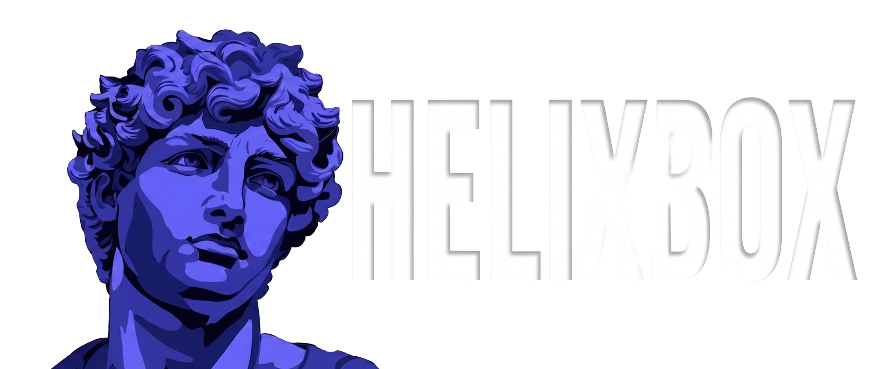

<div align="center">
  <a href="https://youtu.be/hJdMhwVPGUQ?si=tEuMQ7ZixC06ETWz">
    
  </a>
</div><br />
<p align="center">AI-powered mobile IDE and cloud development platform. Code on your phone, run on your machine or in secure cloud sandboxes.</p> <br />

<p align="center">
  <a href="https://youtu.be/hJdMhwVPGUQ?si=tEuMQ7ZixC06ETWz"><b>Explore the live app &gt;&gt;</b></a>
</p>
<p align="center">
  <a href="https://youtu.be/hJdMhwVPGUQ?si=tEuMQ7ZixC06ETWz"></a>
  &nbsp;•&nbsp;
  <a href="#usage"></a>
  &nbsp;•&nbsp;
  <a href="https://github.com/devndesigner6/helix-box/issues"></a>
  &nbsp;•&nbsp;
  <a href="https://github.com/devndesigner6/helix-box/issues"></a>
</p>

## Structure

| Directory | Description |
|-----------|-------------|
| `app/` | Expo/React Native mobile app |
| `cli/` | CLI tool (`helixbox-cli`) |
| `manager/` | Manager server |
| `proxy/` | Proxy server |
| `pty/` | Rust PTY binary uses wezterm internal libs for rendering |

<br />

## Usage

This can be used in two ways, both are for coding:

- Helix Box Connect: One is when you want to remotely use pc without dealing with ssh and shit, geared towards coding
- Helix Box Cloud: Coming soon

<br /> 

## App

Mobile app for iOS/Android/Web built with Expo. App is just a dumb client with most logic on cli and app just acting as a rendering client.

- File explorer and editor
- Git integration
- Terminal emulator
- Process management

### Supported Languages (22)

`en`, `zh`, `ja`, `ko`, `es`, `pt`, `de`, `fr`, `vi`, `ru`, `id`, `pl`, `tr`, `it`, `nl`, `sv`, `uk`, `fi`, `zh-TW`, `tw`, `ms`, `es-MX`

<br />

## CLI

Node.js CLI that bridges your local machine to the app via WebSocket. Can be ran using `npx helixbox-cli`

- Filesystem operations (read, write, grep, etc.)
- Git commands (status, commit, push, pull, etc.)
- Terminal spawning
- Process management
- Port scanning
- System monitoring (CPU, memory, disk, battery)

```bash
npx helixbox-cli
```

<br />

## Manager and Proxy

Bun-based WebSocket relay server that connects CLI and app using session codes. Public verion deployed on gateway.helixbox.dev

- Session management with 10-min TTL
- Dual-channel architecture (control + data)
- QR code pairing

<br />

## PTY

Rust binary for pseudo-terminal management, used by the CLI.

- Real PTY sessions via `wezterm` fork on github.com/sohzm/wezterm
- Screen buffer as cell grid (char + fg + bg per cell)
- 24fps render loop (only sends updates when content changes)
- JSON line protocol over stdin/stdout

<br />

## OpenAI Codex & GPT-5.6 Integration

HelixBox was built and optimized with substantial assistance from OpenAI Codex and GPT-5.6:
- **Rust PTY Delta Engine**: Codex co-authored the optimized incremental screen buffer diffing logic in the Rust PTY rendering loop, ensuring low-latency communication over standard output.
- **WebSocket Reconnection Logic**: GPT-5.6 helped design the network reconnection state machine in the Bun WebSocket proxy to maintain active connection states during mobile cellular handoffs.
- **Protocol Typings**: Codex generated TypeScript definitions for the control-plane RPC protocol to ensure type safety between the mobile app and the local CLI bridge.

<br />

## 📄 License

MIT: See [LICENSE](LICENSE) for details.

<br />

## Star History

<a href="https://www.star-history.com/#devndesigner6/helix-box&Timeline">
 <picture>
   <source media="(prefers-color-scheme: dark)" srcset="https://api.star-history.com/svg?repos=devndesigner6/helix-box&type=Timeline&theme=dark" />
   <source media="(prefers-color-scheme: light)" srcset="https://api.star-history.com/svg?repos=devndesigner6/helix-box&type=Timeline" />
   
 </picture>
</a>
